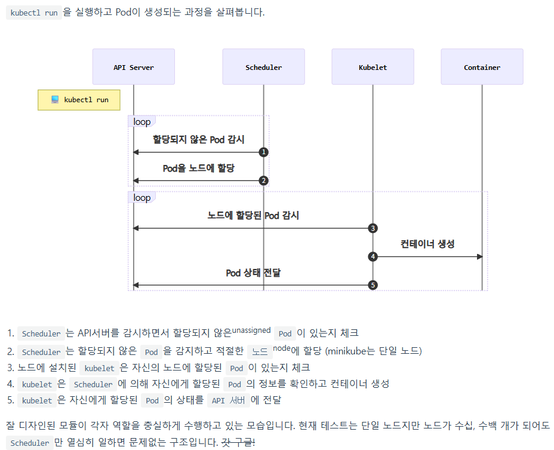
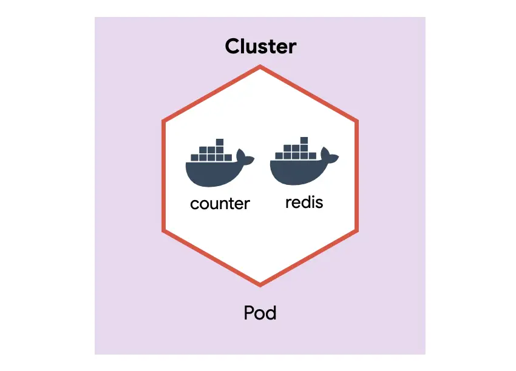

# 내용 정리
### 도커, 쿠버네티스 차이점
- 도커: 컨테이너 생성
- 쿠버네티스: Pod 생성
- Pod: 한 개 또는 여러 개의 컨테이너 포함

Pod 생성
```
yhkim@yhkimclabi:~$ kubectl run echo --image ghcr.io/subicura/echo:v1
pod/echo created
```

Pod 확인
```
yhkim@yhkimclabi:~$ kubectl get pod
NAME   READY   STATUS    RESTARTS   AGE
echo   1/1     Running   0          102s
```

Pod 상세확인  
Events를 가장 많이 확인한다고함
```
yhkim@yhkimclabi:~$ kubectl describe pod/echo
Name:             echo
Namespace:        default
Priority:         0
Service Account:  default
Node:             minikube/192.168.49.2
Start Time:       Wed, 18 Feb 2026 16:29:06 +0900
Labels:           run=echo
Annotations:      <none>
Status:           Running
IP:               10.244.0.16
...생략

Events:
  Type    Reason     Age   From               Message
  ----    ------     ----  ----               -------
  Normal  Scheduled  34s   default-scheduler  Successfully assigned default/echo to minikube
  Normal  Pulled     34s   kubelet            Container image "ghcr.io/subicura/echo:v1" already present on machine and can be accessed by the pod
  Normal  Created    34s   kubelet            Container created
  Normal  Started    33s   kubelet            Container started
```

minikube 클러스터 안에 pod가 있고, Pod 안에 컨테이너가 있다


요런 흐름임, Scheduler는 일종의 감시자 및 Action 지정을, Kubelet이 상태확인 및 생성을 담당하는듯 node가 무슨 역할을 하는지는 모르겠음

`kubectl run`은 거의 안쓰임, docker run과 비슷하게 실무 설정이 어려워서 그런듯  
정석은 Pod를 yaml 파일로 정의하는 것

| 정의      | 설명                         | 예시                                             |
|-----------|----------------------------|--------------------------------------------------|
| version   | 오브젝트 버전               | v1, app/v1, networking.k8s.io/v1, ...            |
| kind      | 종류                        | Pod, ReplicaSet, Deployment, Service, ...        |
| metadata  | 메타데이터                  | name과 label, annotation(주석)으로 구성           |
| spec      | 상세명세                    | 리소스 종류마다 다름                              |

가장 상위?계층에 있는 4개 단어 설명(리소스 정의 4요소)  
리소스를 관리할때는 kin에서 `name`, `label` 사용

```
yhkim@yhkimclabi:~/projects/kuber_practice/03_pod$ kubectl apply -f echo-pod.yaml 
pod/echo created
yhkim@yhkimclabi:~/projects/kuber_practice/03_pod$ kubectl get pod
NAME   READY   STATUS    RESTARTS   AGE
echo   1/1     Running   0          4s
yhkim@yhkimclabi:~/projects/kuber_practice/03_pod$ kubectl logs echo
{"level":30,"time":1771400882768,"pid":7,"hostname":"echo","msg":"Server listening at http://0.0.0.0:3000"}
{"level":30,"time":1771400882768,"pid":7,"hostname":"echo","msg":"server listening on http://0.0.0.0:3000"}
yhkim@yhkimclabi:~/projects/kuber_practice/03_pod$ kubectl exec -it echo -- sh
/app # ls
Dockerfile         README.md          app.js             node_modules       package-lock.json  package.json
/app # 
yhkim@yhkimclabi:~/projects/kuber_practice/03_pod$ kubectl delete -f echo-pod.yaml 
pod "echo" deleted
```


## 다중컨테이너
대부분 1 Pod = 1 컨테이너, 하지만 여러 개 컨테이너도 꽤 흔한 케이스  
이 경우 하나의 Pod에 속한 컨테이너들은 서로 네트워크를 localhost로, 동일한 디렉토리를 공유함

yaml에서 컨테이너 환경 변수 정의법
```
spec:
  containers:
  - name: app
    image: ghcr.io/subicura/counter:latest
    env:
      - name: REDIS_HOST
        value: "localhost"
```
대충 이런 느낌

