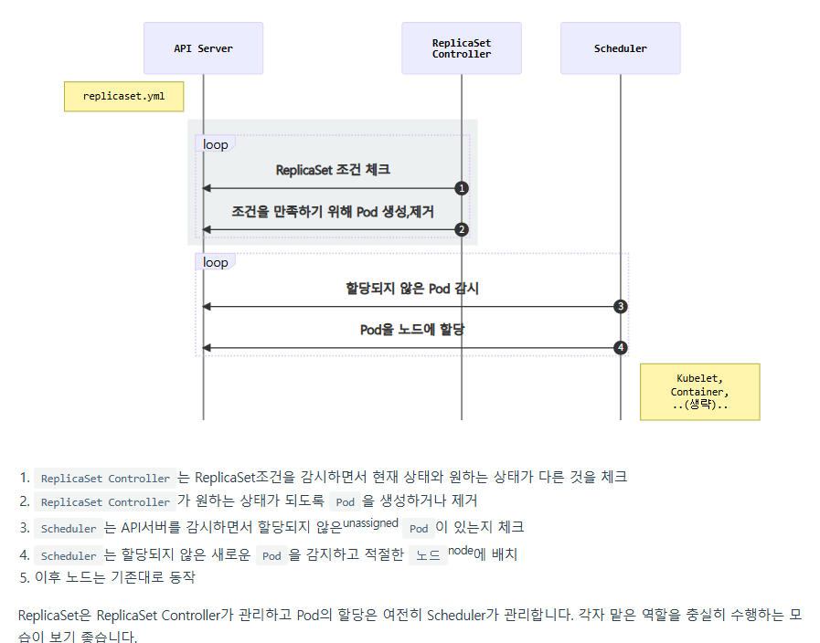

# ReplicaSet
Pod가 죽었을때 자동복구를 위하여 정해진 만큼 복제, 관리하기 위한 개념

```
yhkim@yhkimclabi:~/projects/kuber_practice/04_ReplicaSet/pods$ kubectl get pods,rs
NAME                READY   STATUS    RESTARTS   AGE
pod/echo-rs-wq8th   1/1     Running   0          12s

NAME                      DESIRED   CURRENT   READY   AGE
replicaset.apps/echo-rs   1         1         1       12s
```
### ReplicaSet 하는일
ReplicaSet은 `label을 chk`해서 `원하는 Pod 수` 만큼의 Pod가 없으면 `새로운 Pod`를 생성함

|정의|설명|
|--|--|
|spec.selector	|label 체크 조건|
|spec.replicas	|원하는 Pod의 개수|
|spec.template	|생성할 Pod의 명세|

yaml에서 `template`가 Pod설정과 완전히 동일\
```
yhkim@yhkimclabi:~/projects/kuber_practice/04_ReplicaSet/pods$ kubectl get pod --show-labels
NAME            READY   STATUS    RESTARTS   AGE     LABELS
echo-rs-wq8th   1/1     Running   0          6m30s   app=echo,tier=app
```

app 라벨 제거하면 바로 재시작된걸 알 수  있음
```
yhkim@yhkimclabi:~/projects/kuber_practice/04_ReplicaSet/pods$ kubectl get pod --show-labels
NAME            READY   STATUS    RESTARTS   AGE     LABELS
echo-rs-fxxpf   1/1     Running   0          17s     app=echo,tier=app
echo-rs-wq8th   1/1     Running   0          7m51s   tier=app
```

label 붙여주면 다시 1개로 돌아옴
```
yhkim@yhkimclabi:~/projects/kuber_practice/04_ReplicaSet/pods$ kubectl label pod/echo-rs-wq8th app=echo
pod/echo-rs-wq8th labeled
yhkim@yhkimclabi:~/projects/kuber_practice/04_ReplicaSet/pods$ kubectl get pod --show-labels
NAME            READY   STATUS    RESTARTS   AGE     LABELS
echo-rs-wq8th   1/1     Running   0          8m56s   app=echo,tier=app
```




rs만 4로 증가시키면 pods가 든든하게 증가하는거 확인 가능
```
yhkim@yhkimclabi:~/projects/kuber_practice/04_ReplicaSet/pods$ kubectl get pods,rs
NAME                READY   STATUS    RESTARTS   AGE
pod/echo-rs-c6hqb   1/1     Running   0          10s
pod/echo-rs-ckwqv   1/1     Running   0          10s
pod/echo-rs-d2ngh   1/1     Running   0          39s
pod/echo-rs-knxzf   1/1     Running   0          10s

NAME                      DESIRED   CURRENT   READY   AGE
replicaset.apps/echo-rs   4         4         4       13m
```