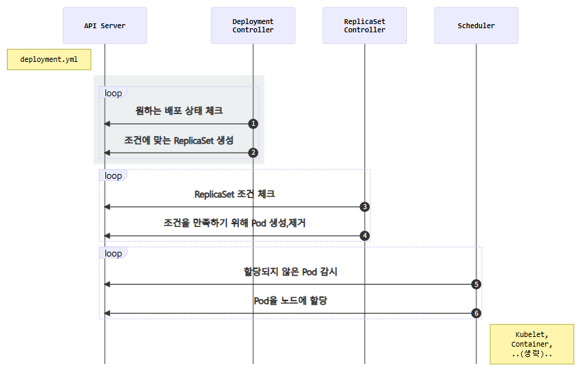

# Deployment
```
apiVersion: apps/v1
kind: Deployment
metadata:
  name: echo-deploy
spec:
  replicas: 4
  selector:
    matchLabels:
      app: echo
      tier: app
  template:
    metadata:
      labels:
        app: echo
        tier: app
    spec:
      containers:
        - name: echo
          image: ghcr.io/subicura/echo:v1
---
image: ghcr.io/subicura/echo:v2
```
위 pod를 image만 다르게 하고 다시 시작하면  
기존 pod들이 죽고 새로운 버전의 pod가 시작됨(like update)

```
kubectl describe deploy/echo-deploy
---
......
Events:
  Type    Reason             Age    From                   Message
  ----    ------             ----   ----                   -------
  Normal  ScalingReplicaSet  17m    deployment-controller  Scaled up replica set echo-deploy-7796596475 from 0 to 4
  Normal  ScalingReplicaSet  2m57s  deployment-controller  Scaled up replica set echo-deploy-5448898cd4 from 0 to 1
  Normal  ScalingReplicaSet  2m57s  deployment-controller  Scaled down replica set echo-deploy-7796596475 from 4 to 3
  Normal  ScalingReplicaSet  2m57s  deployment-controller  Scaled up replica set echo-deploy-5448898cd4 from 1 to 2
  Normal  ScalingReplicaSet  2m53s  deployment-controller  Scaled down replica set echo-deploy-7796596475 from 3 to 2
  Normal  ScalingReplicaSet  2m53s  deployment-controller  Scaled up replica set echo-deploy-5448898cd4 from 2 to 3
  Normal  ScalingReplicaSet  2m52s  deployment-controller  Scaled down replica set echo-deploy-7796596475 from 2 to 1
  Normal  ScalingReplicaSet  2m52s  deployment-controller  Scaled up replica set echo-deploy-5448898cd4 from 3 to 4
  Normal  ScalingReplicaSet  2m52s  deployment-controller  Scaled down replica set echo-deploy-7796596475 from 1 to 0
```
- v1 rs4 -> v2 rs0
- v1 rs3 -> v2 rs1
...
- v1 rs0 -> v2 rs4


### 시나리오

- Deployment Controller는 Deployment조건을 감시하면서 현재 상태와 원하는 상태가 다른 것을 체크
- Deployment Controller가 원하는 상태가 되도록 ReplicaSet 설정
- ReplicaSet Controller는 ReplicaSet조건을 감시하면서 현재 상태와 원하는 상태가 다른 것을 체크
- ReplicaSet Controller가 원하는 상태가 되도록 Pod을 생성하거나 제거
- Scheduler는 API서버를 감시하면서 할당되지 않은unassigned Pod이 있는지 체크
- Scheduler는 할당되지 않은 새로운 Pod을 감지하고 적절한 노드node에 배치
- 이후 노드는 기존대로 동작

deploment가 API 바로 다음에 들어가서 상태를 chk하고 rs를 할당함.  
이 친구는 rs,pod와는 컨트롤러 개념부터 다름

### 버전관리
사실상 deployment의 꽃

```
# 히스토리 확인
kubectl rollout history deploy/echo-deploy
---
deployment.apps/echo-deploy 
REVISION  CHANGE-CAUSE
1         <none>
2         <none>
```

```
# revision 1 히스토리 상세 확인
kubectl rollout history deploy/echo-deploy --revision=1
---
deployment.apps/echo-deploy with revision #1
Pod Template:
  Labels:       app=echo
        pod-template-hash=7796596475
        tier=app
  Containers:
   echo:
    Image:      ghcr.io/subicura/echo:v1
    Port:       <none>
    Host Port:  <none>
    Environment:        <none>
    Mounts:     <none>
  Volumes:      <none>
  Node-Selectors:       <none>
  Tolerations:  <none>
```

```
# 바로 전으로 롤백
kubectl rollout undo deploy/echo-deploy
---
deployment.apps/echo-deploy rolled back
```

```
# 특정 버전으로 롤백
kubectl rollout undo deploy/echo-deploy --to-revision=2
---
deployment.apps/echo-deploy rolled back
```